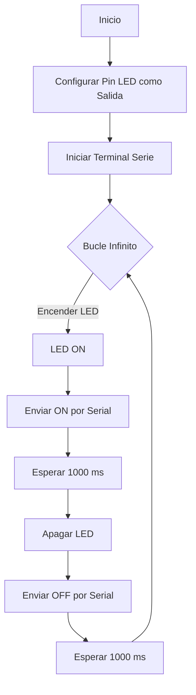
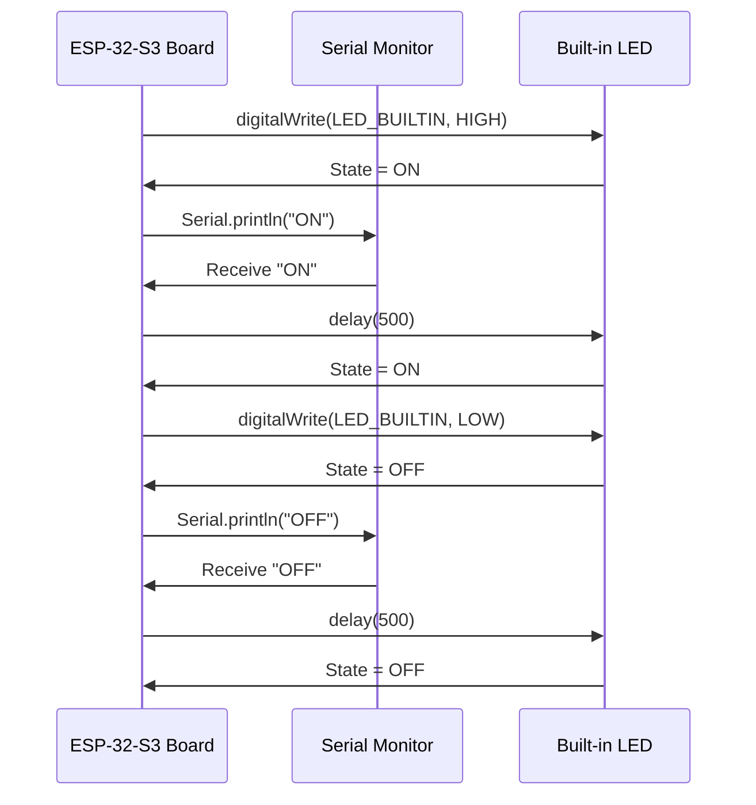
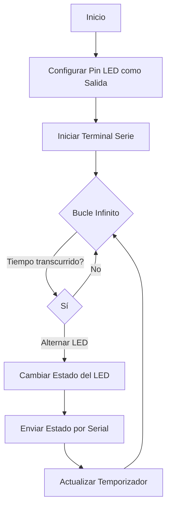
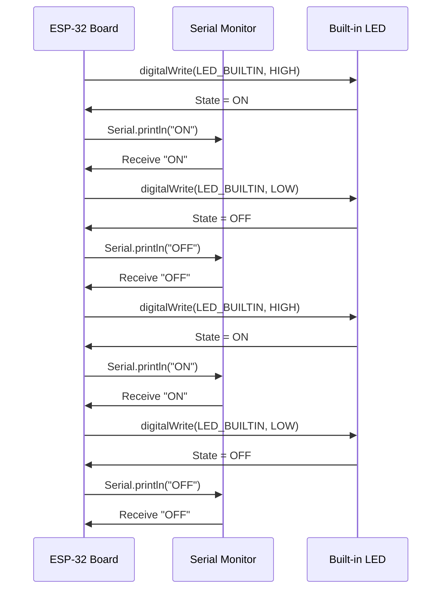

# Práctica 1: Blink con ESP32

## Objetivo
El objetivo de esta práctica es producir el parpadeo periódico de un LED utilizando el ESP32. Además, se empleará la salida serie para depurar el programa.

## Materiales
- Microcontrolador ESP32
- LED (integrado o externo)
- Resistencia (si es necesario)
- Plataforma de desarrollo (Arduino IDE o PlatformIO)

## Código Básico
```cpp
#define LED_BUILTIN 2
#define DELAY 500
 
void setup() {
  pinMode(LED_BUILTIN, OUTPUT);
}

void loop() {
  digitalWrite(LED_BUILTIN, HIGH);
  delay(DELAY);
  digitalWrite(LED_BUILTIN, LOW);
  delay(DELAY);
}
```
 
## Modificación con delay
```cpp
#define LED_BUILTIN 23
#define DELAY 750

void setup() {
  pinMode(LED_BUILTIN, OUTPUT);
  Serial.begin(115200);
}

void loop() {
  digitalWrite(LED_BUILTIN, HIGH);
  Serial.println("ON");
  delay(DELAY);
  digitalWrite(LED_BUILTIN, LOW);
  Serial.println("OFF");
  delay(DELAY);
}
```

## Modificación sin delay
```cpp
#define LED_BUILTIN 23
    #define DELAY 750

    void setup()
    {
        Serial.begin(115200); 
        // Inializa la comunicación serial la velocidad (baudios)
        pinMode(LED_BUILTIN, OUTPUT);
        // Configura el pin como salida del led integrado
    }
    void loop()
    {
        digitalWrite(LED_BUILTIN, HIGH); // Enciende el LED 
        Serial.println("ON"); // Mostrar por pantalla 
        // delay(500); // Sin delay
        digitalWrite(LED_BUILTIN, LOW); // Apaga el LED
        Serial.println("OFF");  
        // delay(500);
    }
```

## Modificar el programa para que actue directamente sobre los registros de los puertos de entrada y salida
```cpp
#include <Arduino.h>

#define LED_BUILTIN 23
#define DELAY 750

#define GPIO_OUT_REG 0x3FF4400C

void setup() {
  Serial.begin(115200);
  pinMode(LED_BUILTIN, OUTPUT);
}

void loop() {
  volatile uint32_t *gpio_out = (volatile uint32_t *)GPIO_OUT_REG;

  *gpio_out |= (1 << LED_BUILTIN);
  digitalWrite(LED_BUILTIN, HIGH);

  Serial.println("ON");
  
  delay(DELAY);

  *gpio_out ^= (1 << LED_BUILTIN);
  digitalWrite(LED_BUILTIN, LOW);

  Serial.println("OFF");

  delay(DELAY);
}
```

##  Medidas con la frecuencia al máximo
1. PRIMER APARTADO
```cpp
#include <Arduino.h>

   #define LED_BUILTIN 23

   void setup() {                
      pinMode(LED_BUILTIN, OUTPUT);   
      Serial.begin(115200);
   }

   void loop() {
      Serial.println("ON");
      digitalWrite(LED_BUILTIN, HIGH);
      Serial.println("OFF");      
      digitalWrite(LED_BUILTIN, LOW);
   }
```
2. SEGUNDO APARTADO
```cpp
#include <Arduino.h>

    #define LED_BUILTIN 23
    uint32_t *gpio_out = (uint32_t *)GPIO_OUT_REG;

    void setup() {                
        pinMode(LED_BUILTIN, OUTPUT);   
        Serial.begin(115200);
    }

    void loop() {
        Serial.println("ON");
        *gpio_out |= (1 << LED_BUILTIN);
        Serial.println("OFF");      
        *gpio_out ^= (1 << LED_BUILTIN);
    }
```
3. TERCER APARTADO
``` cpp
#include <Arduino.h>
    #define LED_BUILTIN 23

    void setup() {                
    pinMode(LED_BUILTIN, OUTPUT);   
    }

    void loop() {
    digitalWrite(LED_BUILTIN, HIGH);
    digitalWrite(LED_BUILTIN, LOW);
    }
```
4. CUARTO APARTADO
 ``` cpp
#include <Arduino.h>

    #define LED_BUILTIN 23
    uint32_t *gpio_out = (uint32_t *)GPIO_OUT_REG;

    void setup() {                
    pinMode(LED_BUILTIN, OUTPUT);   
    }

    void loop() {
    *gpio_out |= (1 << LED_BUILTIN);
    *gpio_out ^= (1 << LED_BUILTIN);
    }
```
## Diagrama de Flujo con delay


## Diagrama de Tiempos con delay


## Diagrama de Flujo sin delay


## Diagrama de Tiempos sin delay

## Tiempo libre del procesador

El tiempo libre del procesador se puede determinar con la siguiente fórmula:

Tiempo libre = Tiempo total del ciclo - Tiempo que el procesador está ocupado ejecutando el bucle

Para calcularlo, primero se debe conocer la duración total de un ciclo, incluyendo los retardos introducidos por delay(). Luego, al medir cuánto tiempo toma la ejecución del bucle sin contar las pausas, restamos ambos valores. De esta manera, obtenemos el tiempo en el que el procesador no está realizando tareas activas.


